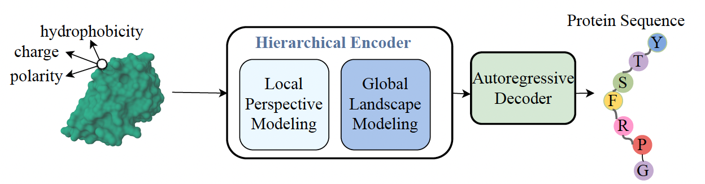

<h1>SurfPro: Functional Protein Design Based on Continuous Surface</h1>

<h2>Model Architecture</h2>

This repository contains code and data for ICML 2024 paper [SurfPro: Functional Protein Design Based on Continuous Surface](https://arxiv.org/pdf/2405.06693)

The overall model architecture is shown below:




<h2>Environment</h2>
The dependencies can be set up using the following commands:

```ruby
conda create -n surfpro python=3.8 -y 
conda activate surfpro 
conda install pytorch=1.10.2 cudatoolkit=11.3 -c pytorch -y 
bash setup.sh 
```

<h2>Download Data</h2>

We provide all surface data for cath 4.2, binder design task and enzyme design task at [SurfPro data](https://drive.google.com/drive/folders/13BdM1j_7Q4iGthsifUxc11yoq03BmdKL?usp=drive_link)

```ruby
mkdir data 
cd data 
mkdir cath42 && cd cath42
wget https://drive.google.com/file/d/1_IUTRpQtQpoPzxUDD7cTzUn150hViN5h/view?usp=drive_link
cd .. && mkdir binder_design && cd binder_design
wget https://drive.google.com/drive/folders/1S7fg-XWBSy6-Pq7bSG_IrlLgLi3ESoX3?usp=drive_link
cd .. && mkdir enzyme_design && cd enzyme_design
wget https://drive.google.com/drive/folders/13EpZ1u7l28W0aR2WfXhIBooK5LZpXqTU?usp=drive_link
```

<h2>Prepare Surface for your own model</h2>

We provided surface data for all three tasks at [SurfPro data](https://drive.google.com/drive/folders/13BdM1j_7Q4iGthsifUxc11yoq03BmdKL?usp=drive_link).

If you want to generate surface from your own PDB files, please use the file preprocess/prepare_surface.py

You need to first apply MSMS tool to generate the corresponding vert files.
Then you need to provide the corresponding fasta file and vert files to prepare corresponding surfaces. To run the code:

```ruby
python preprocess/prepare_surface.py --data_path fasta_file_path --split train --output_path output_data_path
```

The vert files are put in fasta_file_path/msms directory by default.

<h2>Inverse Folding Task Training</h2>
First Download the corresponding data and decompress it:

```ruby
mkdir binder_design && cd binder_design
wget https://drive.google.com/file/d/1_IUTRpQtQpoPzxUDD7cTzUn150hViN5h/view?usp=drive_link
tar -xvzf octree_aa_surf_5k_sorted.tar.gz
```

Then training the model:

```ruby
bash train_surface_inverse_folding.sh
```

<h2>Binder Design Training</h2>
First Download the corresponding data:

```ruby
mkdir binder_design && cd binder_design
wget https://drive.google.com/drive/folders/1S7fg-XWBSy6-Pq7bSG_IrlLgLi3ESoX3?usp=drive_link
```

Then decompress the target-binder data which are necessary for pAE_interaction evaluation.

```ruby
cd binder_design/Binder_Design_Data
tar -xvzf binder.pkl.tar.gz
```

Then training the model. Suppose the model ckpt from inverse folding task is at cath_model_path/checkpoint_best.pt. The training script is shown below:

```ruby
bash binder_design_finetune.sh
```

<h2>Enzyme Design Training</h2>
First Download the corresponding data:

```ruby
mkdir enzyme_design && cd enzyme_design
wget https://drive.google.com/drive/folders/13EpZ1u7l28W0aR2WfXhIBooK5LZpXqTU?usp=drive_link
```

Then training the model. Suppose the model ckpt from inverse folding task is at cath_model_path/checkpoint_best.pt. The training script is shown below:

```ruby
bash binder_design_finetune.sh
```

<h2>Inference</h2>
To generate protein sequences for CATH 4.2, design binders or design enzymes:

```ruby
bash generation_cath42.sh
bash generate_binder.sh
bash generate_enzyme.sh
```

There are two items in the output directory:

1. protein.txt refers to the designed protein sequence
2. src.seq.txt refers to the ground truth sequences


<h2>Evaluation</h2>
<h3>Inverse Folding Task Evaluation</h3>
We provide the recovery rate calculate after pairwise alignment at evaluation/amino_acid_recovary_rate.py. 

You need to provide the source sequence and designed sequence files.

<h3>Binder Design Task Evaluation</h3>
To calculate the superimpose files of designed binder and target proteins, please use file evaluation/super_impose.py

Then we apply scripts provided at [dl_binder_design](https://github.com/nrbennet/dl_binder_design) to calculate pAE_interaction scores.

<h3>Enzyme Design Task Evaluation</h3>
We provide the ESP evaluation data at [ESP_data_eval](https://drive.google.com/file/d/1LlYvJvV69dxtqblAUAkJ-CbFs9h_Q34j/view?usp=drive_link)

The format for ESP evaluation is (Protein_Sequence Substrate_Representation) for each test case.

The evaluation code for ESP score is developed by Alexander Kroll, which can be found at [link](https://github.com/AlexanderKroll/ESP_prediction_function/tree/main)


<h2>Citation</h2>
If you find our work helpful, please consider citing our paper.

```
@inproceedings{songsurfpro,
  title={SurfPro: Functional Protein Design Based on Continuous Surface},
  author={Song, Zhenqiao and Huang, Tinglin and Li, Lei and Jin, Wengong},
  booktitle={Forty-first International Conference on Machine Learning},
  year={2024}
}
```
